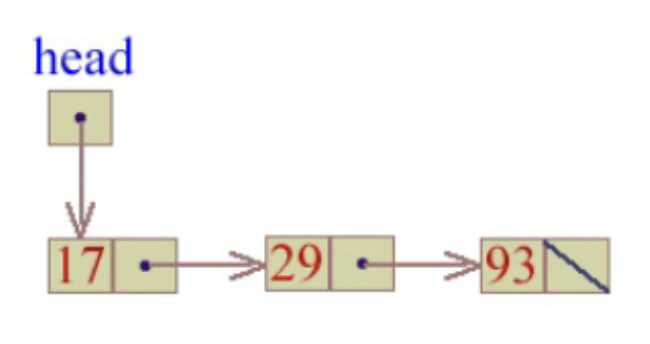

# Linked List

### 1. What is Linked List?

โครงสร้างข้อมูลที่เก็บข้อมูลแบบเชื่อมต่อกัน โดยมีโหนดหนึ่งเป็นจุดเริ่มต้น และโหนดหนึ่งเป็นจุดสิ้นสุด โดยโหนดแต่ละตัวจะมีข้อมูลและตำแหน่งของโหนดถัดไป\
_-เก็บข้อมูลไว้ใน node_

### Example linked list in Data



```C
struct node {
    int data;
    struct node *next;
};

int main()
{
    struct node *head = NULL;
    struct node *first = NULL;
    struct node *second = NULL;
    struct node *third = NULL;

    // allocate 3 nodes in the heap
    first = (struct node *)malloc(sizeof(struct node));
    second = (struct node *)malloc(sizeof(struct node));
    third = (struct node *)malloc(sizeof(struct node));

    head = first; // save the head
    first.data = 17; // assign data in first node
    first.next = second;

    second->data = 29;
    second->next = third;


    thrird->data = 93;
    third->next = NULL;
}
```

> access data in pointer struct use `->` instead of `.`

### Create a Linked List

_ไอเดียการขัดลำดับ data in linked list จะเป็นลักษณะ queue_

- **Stack**

```C
struct node *create_stack_list(int input[], int size)
{
    struct node *head, *temp;
    int i;

    head = NULL;

    for (i = 0; i < size; i++)
    {
        temp = (struct node *)malloc(sizeof(struct node));
        temp->data = input[i];
        temp->next = head;
        head = temp;
    }

    return head;
};
```

- **Queue**

```C
struct node *create_Qist(int input[], int size)
{
    struct node *head, *tail, *temp;
    int i;

    head = tail = NULL;

    for (i = 0; i < size; i++)
    {
        temp = (struct node *)malloc(sizeof(struct node));
        temp->data = input[i];
        temp->next = NULL;

        if (head == NULL)
        {
            head = temp;
        }
        else
        {
            tail->next = temp;
        }
        tail = temp;
    }

    return head;
};
```

### Accessing elements in Linked List (Traversal)

```C
void print_list(struct node *head)
{
    struct node *temp = head;

    while (temp != NULL)
    {
        printf("%d ", temp->data);
        temp = temp->next;
    }
}
```

or

```C
void print_list(struct node *head)
{
    struct node *temp = head;

    for (temp; temp; temp = temp->next)
    {
        printf("%d ", temp->data);
    }
}
```

### Delete data in Linked List

```C

```

### Insert data in linked list

```C
typedef struct node
{
    int data;
    struct node *next;
} Node;
```

```C
void insert_node_after(Node **head_ref, int input )
{
    Node *n;
    n = (Node *)mallocs(sizeof(Node));
    n -> data = input;
    n -> next = *head_ref;
    *head_ref = n
}
```

**เพิ่ม data เข้าระหว่าง list**

```C
insert_value = 33;
temp = head; // previous data in list

insert_node_after(temp, insert_value)
```

### Doubly Linked List

แต่ละ node ที่ติดกัน ลิงค์ 2 ลิงค์
